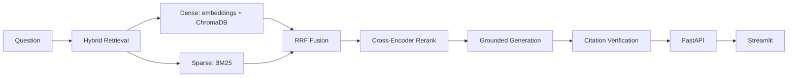

# Clinical CKD RAG System

A citation-verified Retrieval-Augmented Generation system for chronic kidney disease (CKD) clinical guidelines — hybrid retrieval, cross-encoder reranking, grounded generation, and independent LLM-as-judge citation verification, served via FastAPI with a Streamlit frontend.

**Key Features**
- Hybrid retrieval (dense embeddings + BM25) fused via Reciprocal Rank Fusion, not dense-only search
- A verification layer that checks every generated citation against its source chunk, independent of the generation call
- A 30-case automated evaluation harness scoring retrieval hit rate, correctness, faithfulness, and citation accuracy across five test categories
- Production FastAPI service (lifespan-managed state, structured Pydantic responses, background-task ingestion) — not a notebook
- Hand-rolled chunking/fusion/verification logic — no LangChain

---

## Results

30-question golden evaluation set, scored via LLM-as-judge:

| Metric | Score |
|---|---|
| Retrieval hit rate | 93.3% |
| Answer correctness | 76.7% |
| Context faithfulness | 70.0% |
| Citation accuracy | 70.0% |

| Category | n | Retrieval Hit | Correctness | Faithfulness | Citation Acc |
|---|---|---|---|---|---|
| Direct lookup | 8 | 87.5% | 100.0% | 75.0% | 75.0% |
| Multi-hop synthesis | 8 | 100.0% | 37.5% | 75.0% | 75.0% |
| Clinical application | 5 | 80.0% | 60.0% | 60.0% | 60.0% |
| Versioned/ambiguous guidance | 4 | 100.0% | 100.0% | 25.0% | 25.0% |
| No-answer-in-corpus (adversarial) | 5 | 100.0% | 100.0% | 100.0% | 100.0% |

**Known limitations:**
- Multi-hop correctness (37.5%) lags despite 100% retrieval hit rate — generation occasionally conflates facts from same-topic documents published in different years (mitigated via explicit document year tagging, not fully solved).
- Versioned/ambiguous questions over-cite in long comparison answers, lowering faithfulness even when core facts are correct.

---

## Architecture



1. **Ingestion** — PyMuPDF extraction, section-aware chunking, cosine-similarity dedup.
2. **Hybrid retrieval** — dense (OpenAI embeddings + ChromaDB) and sparse (BM25) run in parallel, combined via rank-based RRF.
3. **Reranking** — cross-encoder (`BAAI/bge-reranker-base`) rescopes ~100 fused candidates to top 8.
4. **Generation** — Claude, structured outputs, forced grounding + multi-doc synthesis rules; citations rebuilt deterministically from retrieved chunks, never trusted from model output.
5. **Verification** — second Claude pass checks each citation against its evidence, batched per-answer.
6. **Response assembly** — merged into one structured object: answer, sources, confidence, citation counts, unsupported claims.

---

## Tech stack

| Component | Tool |
|---|---|
| Language | Python 3.11 |
| PDF parsing | PyMuPDF |
| Chunking | Hand-rolled, section-aware (no LangChain) |
| Embeddings | OpenAI `text-embedding-3-small` |
| Vector store | ChromaDB (persistent, cosine space) |
| Sparse retrieval | `rank_bm25` |
| Fusion | Custom Reciprocal Rank Fusion |
| Reranking | `sentence-transformers` cross-encoder (`BAAI/bge-reranker-base`) |
| Generation + judging | Anthropic Claude (structured outputs) |
| Backend | FastAPI (lifespan-managed state, `/v1` router) |
| Frontend | Streamlit |
| Containerization | Docker + Docker Compose |

---

## Project structure

```
├── api/                  # FastAPI service — /v1/ask, /v1/documents, /v1/ingest
├── frontend/              # Streamlit app
│   ├── components/        # UI rendering only
│   └── services/          # api_client.py — all HTTP calls
├── src/
│   ├── ingestion/          # PDF loading, chunking
│   ├── retrieval/          # Dense/sparse retrievers, RRF, reranker
│   ├── generation/         # Generator, citation verifier, response builder
│   └── evaluation/         # Automated eval harness
├── data/                  # Source PDFs + processed chunks/indexes
├── docker-compose.yml
├── Dockerfile.backend
└── Dockerfile.frontend
```

---

## Run it

**Docker:**
```bash
echo "ANTHROPIC_API_KEY=sk-ant-..." >> .env
echo "OPENAI_API_KEY=sk-..." >> .env
docker compose up --build
```
Backend: `localhost:8000` (`/docs` for Swagger). Frontend: `localhost:8502`.

**Local:**
```bash
pip install -r requirements.txt
uvicorn api.main:app --reload          # backend
cd frontend && streamlit run app.py    # frontend, separate terminal
```

**Eval:**
```bash
python -m src.evaluation.evaluator
```

---

## API

`POST /v1/ask` — `{ "query": str, "top_n": int, "retrieval_k": int }` → structured answer with sources, confidence, citation verification.

`GET /v1/documents` — indexed document/chunk statistics.

`POST /v1/ingest` — background ingestion of new PDFs (extraction → chunking → embedding → BM25 rebuild).

---


